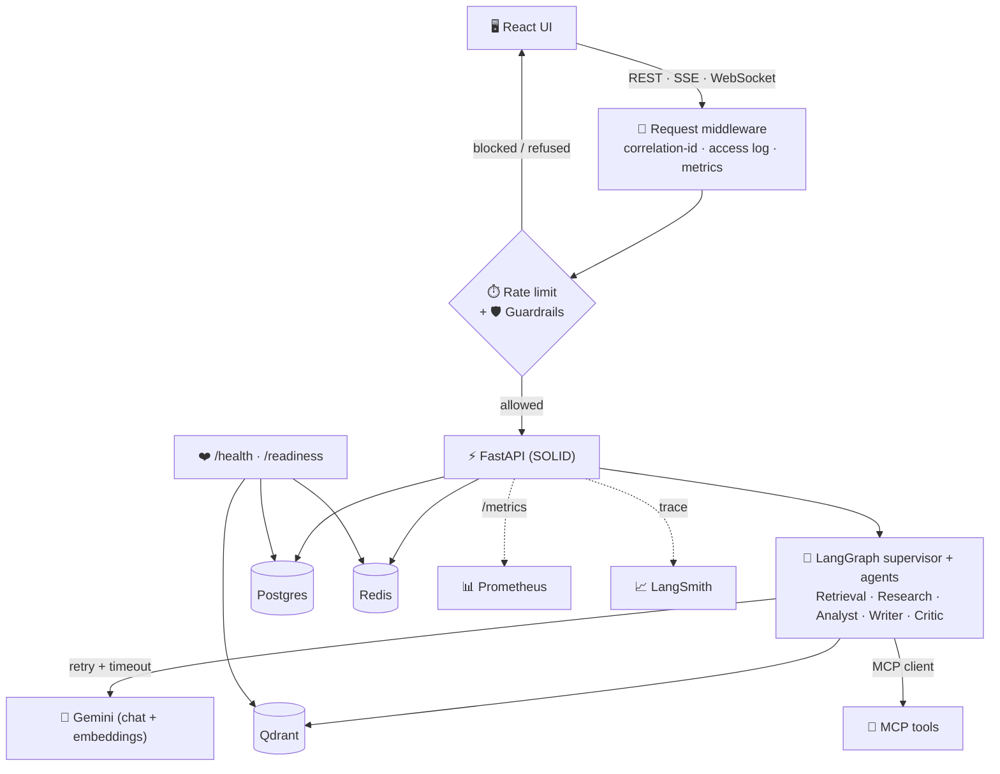

<p align="center">
  
</p>

# FinSight in Production — Hardening a Multi-Agent Financial Assistant with Reliability, Guardrails & Observability

> **AAIDC Module 3 — Agentic AI in Production.**
> 🌐 **Live app:** https://finsightagent.tech · **API:** https://api.finsightagent.tech/api/v1/health
> 📦 **Repository:** https://github.com/phanminhtai23/finsight-agentic-production
> Builds on the Module 2 multi-agent system: https://github.com/phanminhtai23/finsight-multi-agent

## TL;DR

**FinSight** is a multi-agent financial research assistant (LangGraph supervisor + Retrieval,
Market Research, Analyst, Writer, Critic agents over a Qdrant RAG layer, MCP tools, and grounded
citations). Project 2 made it *work*. **Project 3 makes it *operable*** — I added the layers a real
deployment needs: **reliability** (retries/timeouts around every model call), a **safety guardrail
layer** (prompt-injection defense, PII redaction, advice disclaimer), **observability** (correlation
ids, structured logs, Prometheus metrics, a consistent error envelope), **health/readiness probes**,
**per-user rate limiting**, **fail-fast secure config**, **CI/CD**, a **hardened container**, and an
**offline adversarial safety evaluation**. 69 automated tests gate the system.

## The Problem (Project 3 framing)

A demo that calls an LLM and returns an answer is not a product. In production the model provider
rate-limits you, users send adversarial or sensitive input, dependencies go down, and operators need
to see *what happened* when something breaks. Project 3 is about closing exactly that gap on top of
an existing agentic system — turning FinSight from "runs on my machine" into "safe to operate".

## What I Added (the six pillars)

### 1. Reliability — surviving a flaky provider
Every LLM and embedding call is wrapped in **bounded retry + exponential backoff with jitter +
per-attempt timeout**, retrying only *transient* failures (429 / 5xx / timeout / connection drops)
and re-raising the rest. Streaming retries **only before the first token**, so a blip at connect
time recovers without ever duplicating mid-stream output.
→ `app/core/resilience.py`, wired in `app/core/llm.py`.

### 2. Safety guardrails — input *and* output
A fast, dependency-free layer that runs before and after the model:
- **Prompt-injection / jailbreak defense** — refuses "ignore previous instructions / reveal your
  system prompt / act as DAN / developer mode" patterns instead of forwarding them.
- **PII redaction** — emails, phone, credit-card and SSN-like numbers masked before they reach
  logs, traces or the prompt.
- **Input limits** — empty / over-length rejection for abuse and cost control.
- **Not-financial-advice disclaimer** — auto-appended to investment-style answers.
→ `app/core/guardrails.py`, applied on both the streaming chat and `/ask` paths.

### 3. Observability — logs, metrics, errors
- **Correlation id** per request, bound to every log line and returned as `X-Request-ID`.
- **Structured access logs** (JSON in prod) with method, path, status, latency.
- **Prometheus `/metrics`** — request rate/latency, LLM calls & retries, guardrail blocks,
  rate-limit hits (plus default process metrics).
- **Consistent error envelope** — `{"error": {code, message, request_id}}`; never a raw stack trace.
→ `app/core/middleware.py`, `app/core/metrics.py`, `app/core/errors.py`.

### 4. Health & readiness
`/health` (liveness) and `/readiness` — the latter actively checks **Postgres, Redis and Qdrant**
concurrently and returns `503 degraded` if any dependency is unreachable, so an orchestrator only
sends traffic when the system can actually serve it.

### 5. Rate limiting
A **Redis fixed-window** limiter keyed per authenticated user on the expensive chat endpoint. It
**fails open** if Redis is unavailable (availability over enforcement) and emits a metric on every
block. → `app/core/ratelimit.py`.

### 6. Secure-by-default config & deployment
- The app **refuses to boot** in `ENVIRONMENT=prod` with a default/weak `JWT_SECRET` or a missing
  `GOOGLE_API_KEY` (fail-fast validation in `config.py`).
- A **hardened image** (`backend/Dockerfile.prod`): multi-stage, non-root, container `HEALTHCHECK`,
  multi-worker uvicorn — and a production `docker-compose.prod.yml` (built images, restart policies).
- **CI** (`.github/workflows/ci.yml`): ruff lint + format check + pytest-with-coverage on the
  backend, and tsc + vite build on the frontend, on every push/PR.

## Architecture



Guardrails and rate limiting sit at the edge; reliability wraps the model boundary; observability
spans the whole request. Full map + verify-steps in [`PRODUCTION.md`](docs/PRODUCTION.md).

## Evaluation

| Dimension | Tooling | Result |
|-----------|---------|--------|
| Answer quality vs no-RAG baseline | `evals/run_eval.py` (LangSmith) | expected-recall, citation coverage, LLM-judge groundedness |
| **Safety (adversarial)** | `evals/run_safety_eval.py` — **offline**, no API | injection block **5/5**, benign false-positive **0/3**, PII redaction **2/2** |
| Regression gates | `pytest` — **69 tests** | reliability, guardrails, rate-limit, health, error-envelope, prod-config |

The safety eval is a labelled adversarial set (`evals/safety_dataset.py`) and doubles as a CI gate
(`tests/test_safety_eval.py`), so a future change that weakens the guardrail fails the build.

## Reproduce

```bash
cp .env.example .env          # set GOOGLE_API_KEY (free: aistudio.google.com/apikey)
docker compose up -d --build  # postgres, qdrant, redis, mcp, api, worker
docker compose exec api alembic upgrade head

# verify the hardening
docker compose exec api pytest -q              # 69 tests
docker compose exec api python -m evals.run_safety_eval
curl localhost:8000/api/v1/readiness           # {"status":"ready","dependencies":{...}}
curl localhost:8000/metrics | grep finsight_   # Prometheus metrics

# production-style run (enforces secure config, non-root image, restart policies)
docker compose -f docker-compose.prod.yml --env-file .env up -d --build
```

A ready-made report ships at `samples/sample_financial_report.docx` for an end-to-end chat demo
(see the *Quick demo* section of [`README.md`](README.md)).

## Responsible AI

FinSight is a research aid, **not financial advice**: investment-style answers carry an automatic
disclaimer, every factual claim is citation-backed, user data is per-user scoped, and PII is redacted
before logging. Intended use, limitations and risk mitigations are documented in
[`MODEL_CARD.md`](docs/MODEL_CARD.md).

## What I Learned

- **Productionizing is mostly about the unhappy paths.** The interesting work was failure modes —
  rate limits, injection, dependency outages — not the happy-path answer.
- **Guardrails must be testable.** Encoding adversarial cases as a dataset + CI gate turned "we have
  safety" into a measurable, regression-proof claim.
- **Observability pays for itself immediately.** A correlation id threaded through structured logs
  made every other feature easier to build and debug.
- **Fail fast, fail open — pick per concern.** Config validation should fail *fast* (refuse to boot
  insecure); the rate limiter should fail *open* (don't take the app down if Redis blips).

---

**Repository:** https://github.com/phanminhtai23/finsight-agentic-production ·
**Docs:** [README](README.md) · [PRODUCTION.md](docs/PRODUCTION.md) · [MODEL_CARD.md](docs/MODEL_CARD.md) ·
**Contact:** Phan Minh Tai — phanminhtai23@gmail.com

**Tags:** `agentic-ai` · `production` · `mlops` · `llmops` · `multi-agent` · `langgraph` · `rag` ·
`guardrails` · `observability` · `prometheus` · `reliability` · `ci-cd` · `fastapi` · `aaidc`
